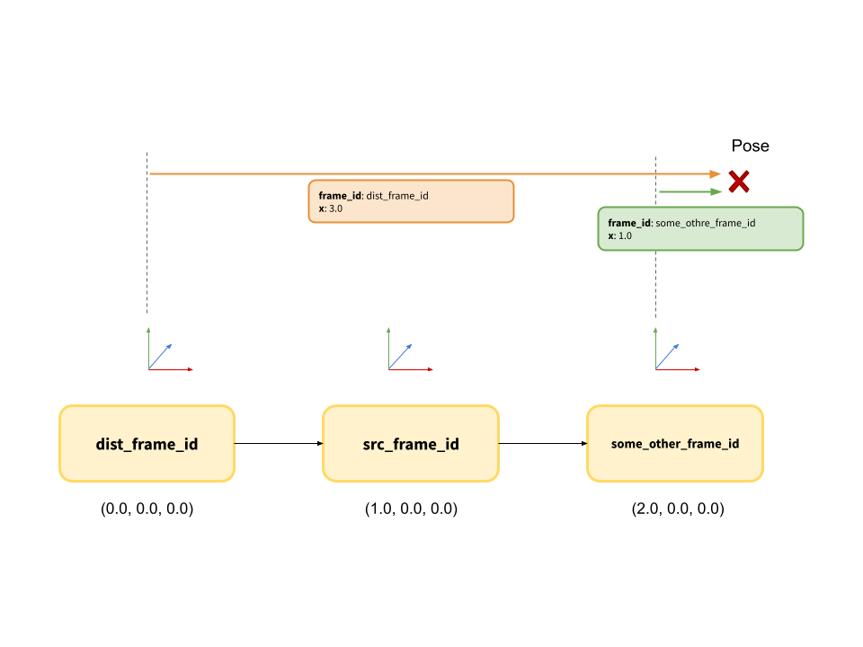

# TF Handler
TF(Transform Handler) makes the access of TF resources simple.
This resources can be used as a member of Node|LifecycleNode.

## Usage


### Setup in the constructor.

```cpp
auto handler = std::make_shared<PoseTfHandler>(
      this->get_node_clock_interface(), this->get_node_logging_interface());

handler->configure();

handler->setSrcFrameId("src_frame_id");
handler->setDistFrameId("dist_frame_id");

// This line blocks until TF resources available.
handler->activate();
```


### 1. Transform Src Zero Point -> Dist

```cpp
PoseStamped out;
handler->tfSrc2Dist(out);
// out.pose.position.x -> 1.0
```

### 2. Transform Given Frame Id -> Dist

```cpp
PostStamped in, out;
in.header.frame_id = "some_other_frame_id";
in.pose.position.x = 1.0;

handler->tf2Dist(in, out);
// out.pose.position.x -> 3.0
```
